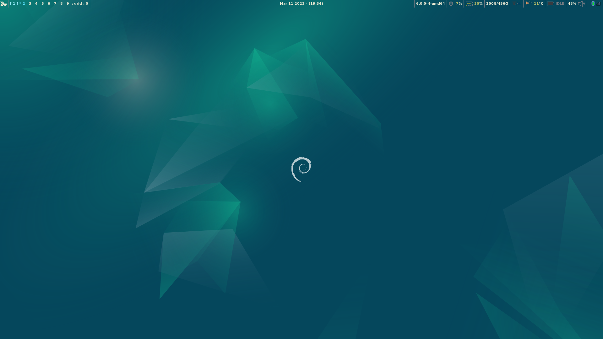
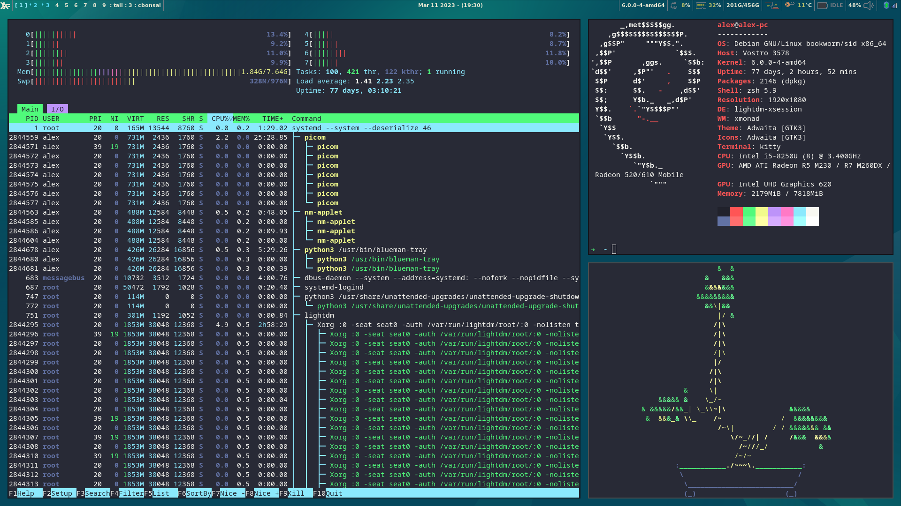
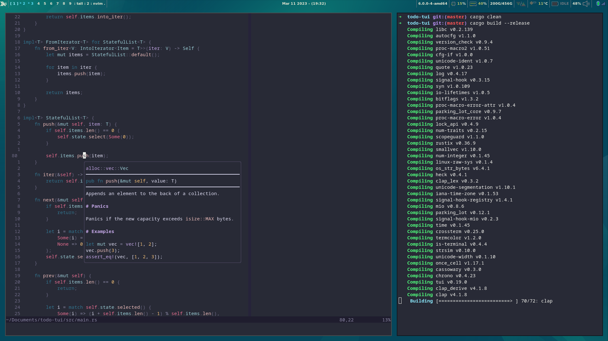

<div align="center">

# XMonad Config

##### My dotfiles for XMonad





</div>

## Install (Ubuntu/Debian)

1. First install all the dependencies needed throughout the installer.

```console
sudo apt install curl
curl https://raw.githubusercontent.com/alexjercan/xmonad.dotfiles/master/packages.txt | xargs sudo apt install -y
```

1. Clone the repository and install the dotfiles

```console
git clone https://github.com/alexjercan/xmonad.dotfiles.git
cd xmonad.dotfiles
./install
```

2. Install ghcup

Note: Choose default settings for ghcup

```console
curl --proto '=https' --tlsv1.2 -sSf https://get-ghcup.haskell.org | sh
```

3. Install xmonad

```console
cd xmonad
stack install
```

Stack will install xmonad in `$HOME/.local/bin` which might need to be added to the PATH.

4. Install a terminal emulator and set it to default in xmonad config to use it. I wanted to try kitty out.

```console
sudo apt install kitty
```

5. At this point you can use xmonad and install a browser and any other tools.

Note: Super+Enter starts the terminal

Note: You can use `.xsession` to start xmonad with `startx`

```console
sudo apt install xinit
```

.xsession:
```bash
#!/bin/sh
exec xmonad
```

```console
startx
```

Note: The other option would be to use a display manager and add the following into /usr/share/xsessions/xmonad.desktop
Or use default.desktop with the modified `.xsession`

```
[Desktop Entry]
Version=1.0
Name=Xmonad
Comment=Use this session to run xmonad as your desktop environment
Exec=xmonad
Icon=
Type=Application
```

Note: I couldn't get xmonad-wallpaper to install so I can use `setRandomWallpaper`. TODO: Check the repo and try to bump the versions somehow

Note: To install lux on ubuntu check [lux](https://github.com/Ventto/lux)

Note: For oh my zsh check [omz](https://github.com/ohmyzsh/ohmyzsh)

Note: For auto suggestions check [zsh-autosuggestions](https://github.com/zsh-users/zsh-autosuggestions)

Note: Install xmobar and dependencies

```console
sudo apt install libxpm-dev
cabal install xmobar --flags="all_extensions"
```

Note: Install brave-browser [brave.com](https://brave.com/linux/) or any other browser

